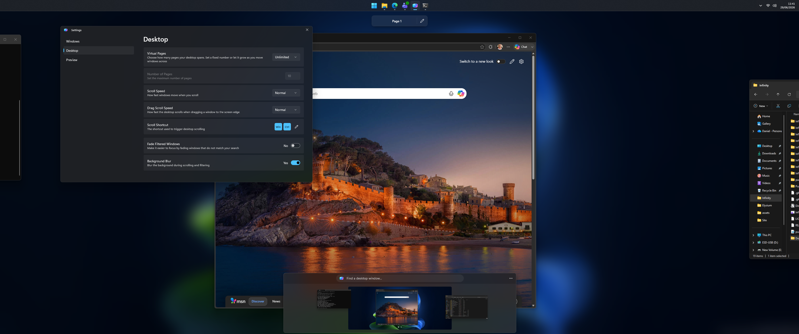

## Screenshot



# Infinity Issues

This repository is the public issue and support tracker for **Infinity**.

Infinity turns your Windows desktop into one large scrollable workspace, making it easier to move around your open windows, find things quickly, and manage lots of running applications.

## What this repository is for

Use this repository to:

* Report bugs
* Request features
* Suggest improvements
* Ask support questions
* Track known issues

## Before opening an issue

Please check whether the issue has already been reported.

When reporting a bug, please include:

* What happened
* What you expected to happen
* Steps to reproduce the issue
* Your Windows version
* Your Infinity version
* Screenshots or screen recordings, if useful

## Useful links

Website: https://elysiumstud.io

## Development

Infinity consumes pinned Elysium packages from the private Elysium Studio GitHub Packages feed. Before restoring the solution, add credentials to your user-level NuGet configuration:

```powershell
dotnet nuget add source "https://nuget.pkg.github.com/elysium-studio/index.json" `
    --name "Elysium Studio" `
    --username "YOUR_GITHUB_USERNAME" `
    --password "YOUR_GITHUB_TOKEN" `
    --store-password-in-clear-text
```

The token must be a classic personal access token with `read:packages`. Do not add credentials to the repository's `NuGet.config`; it contains only package sources and source mapping.
