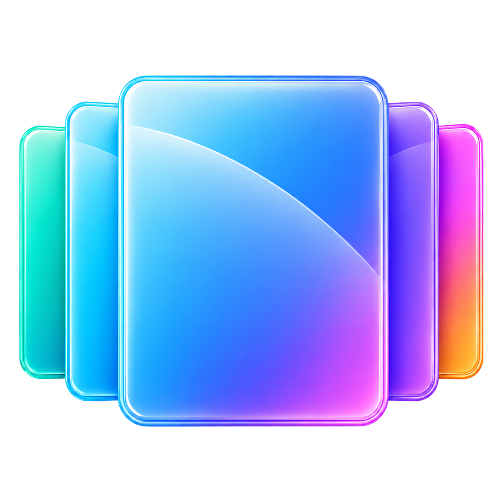
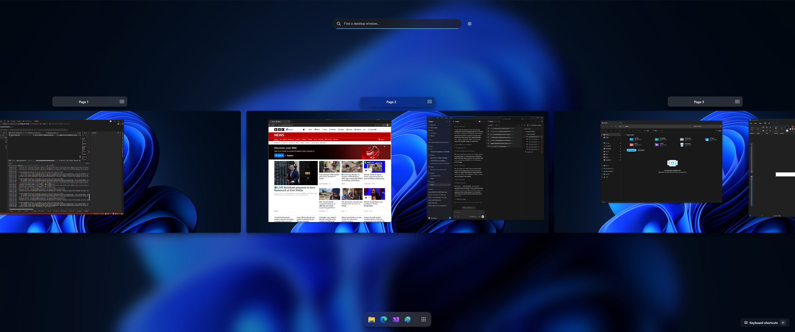
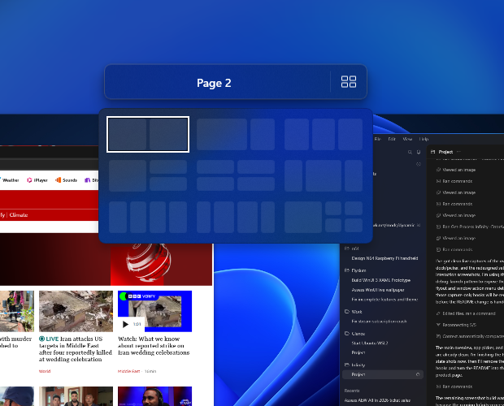
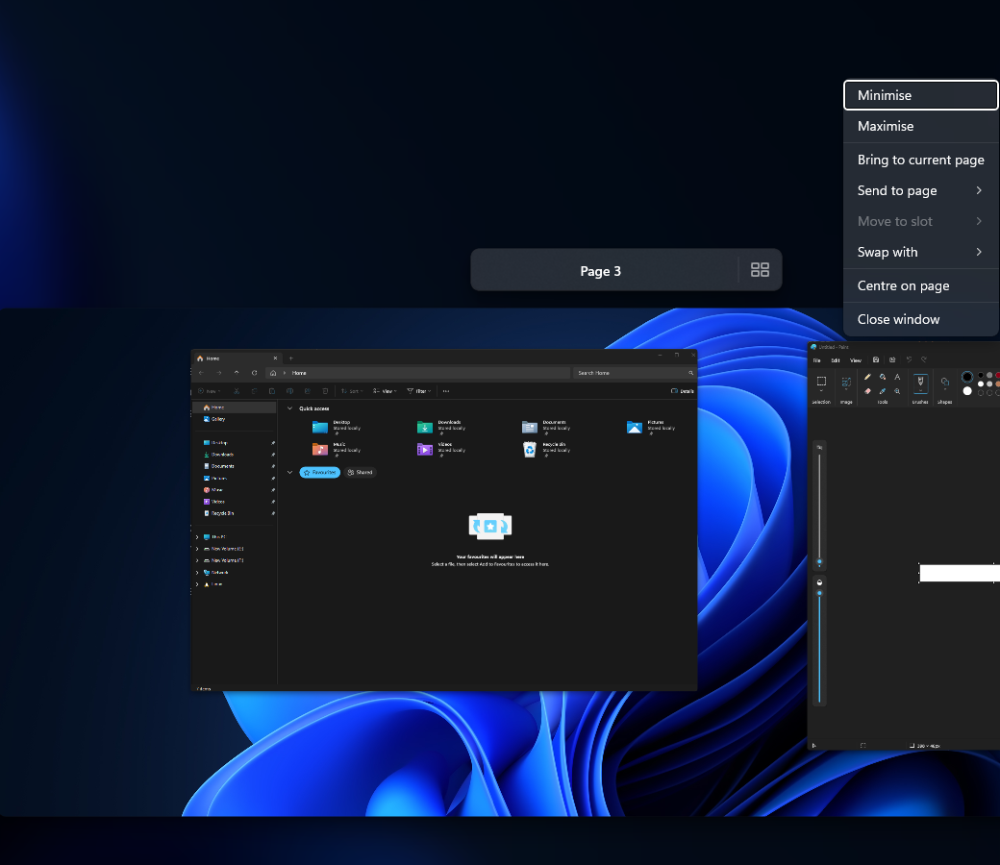
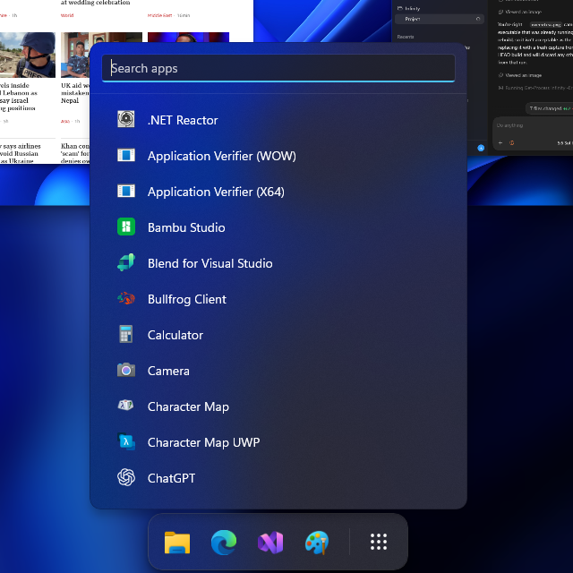
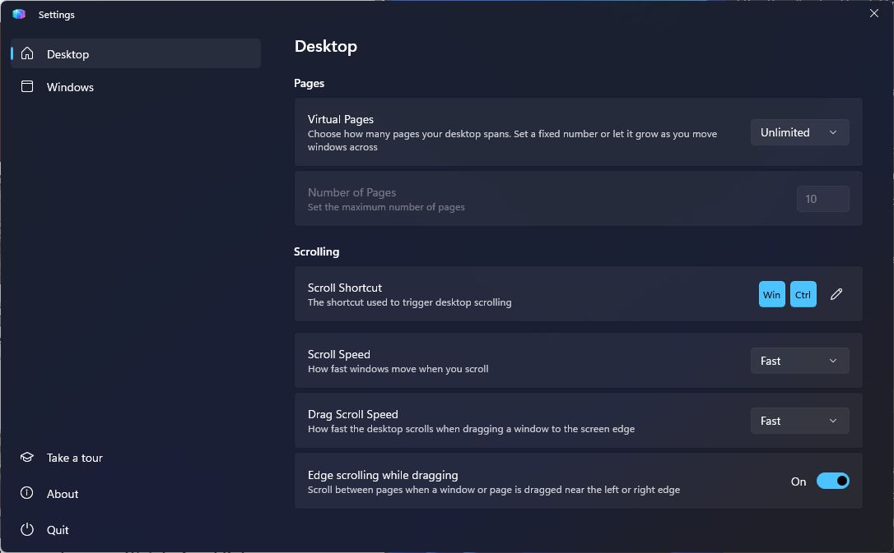

<p align="center">
  
</p>

<h1 align="center">Infinity 2</h1>

<p align="center">
  A fluid, scrollable desktop for Windows 11.
</p>

<p align="center">
  <a href="https://elysiumstud.io">Website</a> ·
  <a href="https://github.com/elysium-studio/Infinity/issues">Report a bug</a> ·
  <a href="https://github.com/elysium-studio/Infinity/issues">Request a feature</a>
</p>



Infinity extends the Windows desktop into a horizontal workspace made from pages. Open the overview to see every page and live window at once, then scroll, search, rearrange, launch apps, or jump straight back into your work. Window cards use live DWM previews rather than static screenshots, so the overview continues to reflect what each application is doing.

Version 2 is a complete redesign around a focused Fluent experience: live previews, wallpaper-aware backdrops, animated navigation, per-page layouts, a built-in app dock, and keyboard-first window management.

## Your whole desktop, at a glance

The overview is the centre of Infinity. Each page represents a real section of the desktop and each card is a live preview of its window.

- Scroll horizontally through a fixed number of pages or let the workspace grow as you use it. Each wheel step advances to the next centred page with an eased animation.
- Click a page or window to return to the desktop at that position.
- Drag a window preview to another page, into a layout slot, or onto an empty area. Dropping on another page navigates there before Infinity returns control.
- Rename pages from their headers. Confirm with the tick, cancel with the cross or `Escape`, and submit with `Enter`.
- Drag page headers to reorder the workspace. Page contents and customisations move together while default numbered titles remain sequential.
- Search across every open window from one place.
- Use a wallpaper, dark, or light backdrop to suit the desktop and system theme.
- Span adjacent displays when their resolution, scaling, and alignment are compatible.

## Organise windows your way

### Page layouts

Give each page its own snap layout. Infinity previews the available regions, helps windows settle into a slot, and lets you change or clear the layout later. **Arrange** distributes the page's existing windows across its configured slots; **Clear** removes the saved layout without resetting the rest of the page.

<p align="center">
  
</p>

### Window actions

Right-click any preview for the actions that matter where you are: minimise, maximise or restore, bring it to the current page, send it to any existing page or a new page, move it to a slot, swap it with another window, centre it, or close it. Commands are enabled from the window's current native state, so maximise becomes restore when appropriate and slot actions appear only when that page has a layout.

<p align="center">
  
</p>

You can also Ctrl-click windows across different pages to add or remove them from a selection and drag the group together. The preview under the pointer stays on top while the remaining windows form an animated stack. Dropping the leader back where the drag began restores the group; dropping elsewhere moves the selection together.

## Launch apps into the workspace

The dock stays at the bottom of the overview and contains taskbar-pinned apps plus apps pinned directly in Infinity—recently opened apps are deliberately left out. Reorder icons by dragging, right-click an app in the picker to pin it, or drag it from the picker into the dock. Infinity pins can be unpinned from their context menu; taskbar pins remain managed by Windows. The final button browses every launchable Start menu app.

<p align="center">
  
</p>

App icons are loaded as they come into view, keeping the picker responsive even on systems with a large Start menu. Searching filters the installed-app catalogue, and launching an app places its window on the currently centred page without dismissing the overview. The picker consumes its own mouse-wheel input so scrolling the app list does not move the pages underneath it.

## Built for mouse and keyboard

Use your configured modifier shortcut and the mouse wheel to open Infinity and move between pages. Once the overview is open, its controls keep navigation, selection, and search inside the workspace. Typing immediately filters windows; Infinity follows matches across pages and returns to the page where the search began when the filter is cleared.

| Action | Shortcut |
| --- | --- |
| Switch pages | Configured modifiers + `←` / `→` |
| Go to a numbered page | Configured modifiers + `1`–`0` |
| Move the focused window to an adjacent page | Configured modifiers + `Shift` + `←` / `→` |
| Send the focused window to a numbered page | Configured modifiers + `Shift` + `1`–`0` |
| Navigate pages in the overview | `←` / `→` |
| Go to a numbered page in the overview | `1`–`0` |
| Select windows in the overview | `↑` / `↓` |
| Cycle through windows | `Tab` / `Shift` + `Tab` |
| Move selected windows | `Shift` + `←` / `→` |
| Add or remove a window from the selection | `Ctrl` + click |
| Open the focused window | `Enter` |
| Search open windows | Start typing |
| Remove the last search character | `Backspace` |
| Close the overview | `Escape` |

Press `F1` or use **Keyboard shortcuts** in the lower-right corner of the overview for an in-app reminder. Modifier keys can be changed in Settings.

## Settings that match how you work

Infinity keeps related controls together and leaves dangerous actions, such as resetting page customisations, clearly separated.

<p align="center">
  
</p>

Configure:

- fixed or unlimited virtual pages;
- the shortcut that activates desktop scrolling, with validation against shortcuts already reserved by Windows or another app;
- normal scrolling and window drag-scroll speed;
- edge scrolling while dragging in the overview;
- snap assistance and per-page customisations;
- wallpaper, dark, or light overview backdrops with foreground colours that adapt to the chosen surface and system theme;
- startup behaviour and compatible-display spanning;
- a full reset for saved page names and layouts, protected by a confirmation dialog.

The guided tour runs during first-time setup and remains available from **Take a tour** in Settings. **Start with Windows**, About, and Quit are available from the Settings navigation as well.

## Getting started

1. Install and start Infinity on a Windows 11 x64 PC.
2. Follow the in-app tour and choose the modifier keys you want to use.
3. Hold those modifiers and scroll to open the overview.
4. Add pages simply by moving farther through an unlimited workspace, or choose a fixed page count in Settings.
5. Drag windows, choose layouts, and pin apps until the workspace fits the way you work.

Infinity 2 is under active development. If something does not behave as expected, [open an issue](https://github.com/elysium-studio/Infinity/issues) with your Infinity version, Windows version, reproduction steps, and a screenshot or recording where useful.

## Development

Infinity is a native Windows application built with C#, WinUI, Windows App SDK, and a native Windows platform layer. The current application target is x64.

### Prerequisites

- Windows 11
- Visual Studio with desktop C++ and Windows application development tooling, or the equivalent .NET and MSBuild workloads
- The .NET SDK selected by [`global.json`](global.json)
- Access to the private Elysium Studio GitHub Packages feed

Add your Elysium package credentials to the user-level NuGet configuration before restoring the solution:

```powershell
dotnet nuget add source "https://nuget.pkg.github.com/elysium-studio/index.json" `
    --name "Elysium Studio" `
    --username "YOUR_GITHUB_USERNAME" `
    --password "YOUR_GITHUB_TOKEN" `
    --store-password-in-clear-text
```

The token must be a classic personal access token with `read:packages`. Do not add credentials to the repository's `NuGet.config`; it contains only package sources and source mapping.

Run the unit tests from the repository root:

```powershell
dotnet restore Infinity.Tests/Infinity.Tests.csproj -p:Platform=x64
dotnet test Infinity.Tests/Infinity.Tests.csproj -c Release -p:Platform=x64 --no-restore
```

GitHub Actions runs the same tests for every pull request and every push to `main`, retaining TRX results and Cobertura coverage for 14 days. The workflow uses the `ELYSIUM_PACKAGES_TOKEN` repository secret for the private feed and falls back to `GITHUB_TOKEN` when the repository has direct package access.

## Feedback and support

Use [GitHub Issues](https://github.com/elysium-studio/Infinity/issues) to report bugs, suggest improvements, request features, or ask for help. Check existing issues first so useful context stays in one place.

Learn more about Infinity and Elysium Studio at [elysiumstud.io](https://elysiumstud.io).
